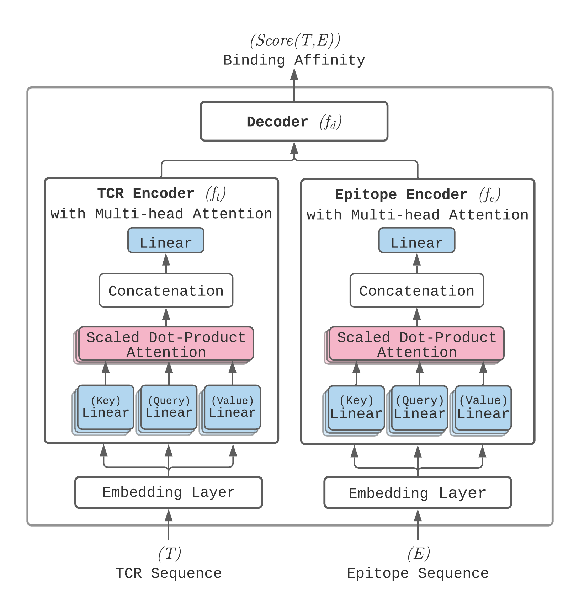

<h1 align="center">
    ATM-TCR
</h1>

ATM-TCR demonstrates how a multi-head self-attention based model can be utilized to learn structural information from protein sequences to make binding affinity predictions.

## Class Project: Model Variants and Results

For this project, we trained ATM-TCR on **EPI** and **TCR** splits using four different variants of hyperparameters. The trained models can be found in the release and their raw performance stats can be seen in the `results/` folder or in the table below.

You can also download the trained models directly from the release section of this repository:  
[**Download Trained Models**](https://github.com/imaad-uni/cse494-599-Project/releases/tag/v1.0.0-ATM-TCR)

Below is a summary of the performance metrics and hyperparameters for each model from the independent test set (INDEP):

---

| Split  | Model Name    | Epoch | Learning Rate | Batch Size | Drop Rate | Accuracy | AUC   | F1 Macro | F1 Micro | Loss       | Precision0 | Precision1 | Recall0 | Recall1 |
|--------|---------------|-------|---------------|------------|-----------|----------|-------|----------|----------|------------|------------|------------|---------|---------|
| TCR    | TCRTest1      | 200   | 0.01          | 32         | 0.25      | 0.7070   | 0.7798| 0.7069   | 0.7070   | 35998.6892 | 0.7034     | 0.7107     | 0.7179  | 0.6959  |
| TCR    | TCRTest2      | 250   | 0.005         | 32         | 0.25      | 0.6757   | 0.8047| 0.6641   | 0.6757   | 39511.7933 | 0.7825     | 0.6270     | 0.4887  | 0.8636  |
| TCR    | TCRTest3      | 300   | 0.001         | 32         | 0.25      | 0.6133   | 0.7950| 0.5697   | 0.6133   | 227517.0810| 0.8171     | 0.5684     | 0.2942  | 0.9338  |
| TCR    | TCRTest4      | 100   | 0.00005       | 32         | 0.25      | 0.7267   | 0.8141| 0.7265   | 0.7267   | 34577.3718 | 0.7416     | 0.7134     | 0.6977  | 0.7558  |
| EPI    | EPITest1      | 200   | 0.01          | 32         | 0.25      | 0.6384   | 0.7011| 0.6384   | 0.6384   | 59885.4547 | 0.6407     | 0.6362     | 0.6303  | 0.6465  |
| EPI    | EPITest2      | 250   | 0.005         | 32         | 0.25      | 0.6016   | 0.7107| 0.5847   | 0.6016   | 94645.5976 | 0.6701     | 0.5724     | 0.4002  | 0.8030  |
| EPI    | EPITest3      | 300   | 0.001         | 32         | 0.25      | 0.5328   | 0.7033| 0.4282   | 0.5328   | 866328.8033| 0.7276     | 0.5177     | 0.1050  | 0.9607  |
| EPI    | EPITest4      | 100   | 0.00005       | 32         | 0.25      | 0.6553   | 0.7222| 0.6552   | 0.6553   | 82424.4179 | 0.6502     | 0.6607     | 0.6722  | 0.6384  |

---

## Usage on SOL
`module load mamba/latest`  
`mamba create --name atm_tcr python=3.8.10`  
`cd /path/to/repo`  
`pip install -r requirements.txt -f https://download.pytorch.org/whl/torch_stable.html`  
`CUDA_VISIBLE_DEVICES=0 python main.py --infile /path/to/train/csv --indepfile /path/to/test/csv --save_model True --model_name MODELNAME --mode=CHANGE_TO_TRAIN_OR_TEST_OR_BLINDTEST --epoch=100 --early_stop=False --lr=0.001 --batch_size=32 --drop_rate=0.25`  


## Publication
<b>ATM-TCR: TCR-Epitope Binding Affinity Prediction Using a Multi-Head Self-Attention Model</b> <br/>
[Michael Cai](https://github.com/cai-michael)<sup>1,2</sup>, [Seojin Bang](https://github.com/SeojinBang)<sup>2</sup>, [Pengfei Zhang](https://github.com/pzhang84)<sup>1,2</sup>, [Heewook Lee](https://scai.engineering.asu.edu/faculty/computer-science-and-engineering/heewook-lee/)<sup>1,2</sup><br/>
<sup>1 </sup>School of Computing and Augmented Intelligence, Arizona State University, <sup>2 </sup>Biodesign Institute, Arizona State University <br/>
Published in: [**Frontiers in Immunology, 2022.**](https://www.frontiersin.org/articles/10.3389/fimmu.2022.893247/full)

## Model Structure

The model takes a pair epitope and TCR sequences as input and returns the binding affinity between the two. The sequences are processing through an embedding layer before reaching the mutli-head self-attention layer. The outputs of these layers are then concatenated and fed through a linear decoder layer to receive the final binding affinity score.



## Requirements
Written using Python 3.8.10

The pip package dependencies are detailed in ```requirements.txt```

To install directly from the requirements list
```
pip install -r requirements.txt
```
It is recommended you utilize a [virtual environment](https://packaging.python.org/en/latest/guides/installing-using-pip-and-virtual-environments/).

## Input File Formatting Format

The input file should be a CSV with the following format:
```
Epitope,TCR,Binding Affinity
```

Where epitope and TCR are the linear protein sequences and binding affinity is either 0 or 1.

```
# Example
GLCTLVAML,CASSEGQVSPGELF,1
GLCTLVAML,CSATGTSGRVETQYF,0
```

If your data is unlabeled and you are only interested in the predictions, simply put either all 0's or all 1's as the label. The performance statistics can be ignored in this case and the predicted binding affinity scores can be collected from the output file.

## Training
To train the model on our dataset using the default settings and on the first GPU
```
CUDA_VISIBLE_DEVICES=0 python main.py --infile data/combined_dataset.csv
```

To change the device to be utilized for training change the ```CUDA_VISIBLE_DEVICES``` to the device number as indicated by ```nvidia-smi```.

The default model name utilized by the program is  ```original.ckpt```. To change the outputted/read model name utilize the following optional argument:
```
--model_name my_custom_model_name
```

After training has finished the model will appear under the ```models``` folder under ```model_name.ckpt``` and two csv files will appear in the ```result``` folder. These files will be called ```perf_model_name.csv``` and ```pred_model_name.csv``` respectively.

```perf_model_name.csv``` contains the a description of performance metrics throughout training. Each line of the csv is the performance of the training model on the validation set in that particular epoch. The last line of the file contains the final performance statistics.
```
# Example
Loss        Accuracy Precision1 Precision0 Recall1 Recall0 F1Macro F1Micro AUC
37814.6235	0.6101	 0.6241	    0.5988	   0.5542  0.666   0.6089  0.6101  0.6749
```

```pred_model_name.csv``` contains the predictions of the model on the validation set of data. Each line is a pair from the validation set along with the label and prediction made by the model. The calculated score from the model is also included.
```
# Example
Epitope     TCR	        Actual Prediction Binding Affinity
GLCTLVAML	CASCWNYEQYF	1	   1	      0.9996516704559326
```
## Testing
To make a prediction using a pre-trained model
```
python main.py --infile data/combined_dataset.csv --indepfile data/covid19_data.txt --model_name my_custom_model_name --mode test
```

The predictions will be saved into the ```result``` folder under the name ```pred_model_name_indep_test_data.csv```. These will be displayed similarly to the validation set predictions made during training.

## Optional Arguments

For more information on optional hyperparameter and training arguments
```
python main.py --help
```

## Data

See the README inside of the data folder for additional information.

## License

Shield: [![CC BY 4.0][cc-by-shield]][cc-by]

This work is licensed under a
[Creative Commons Attribution 4.0 International License][cc-by].

[![CC BY 4.0][cc-by-image]][cc-by]

[cc-by]: http://creativecommons.org/licenses/by/4.0/
[cc-by-image]: https://i.creativecommons.org/l/by/4.0/88x31.png
[cc-by-shield]: https://img.shields.io/badge/License-CC%20BY%204.0-lightgrey.svg
